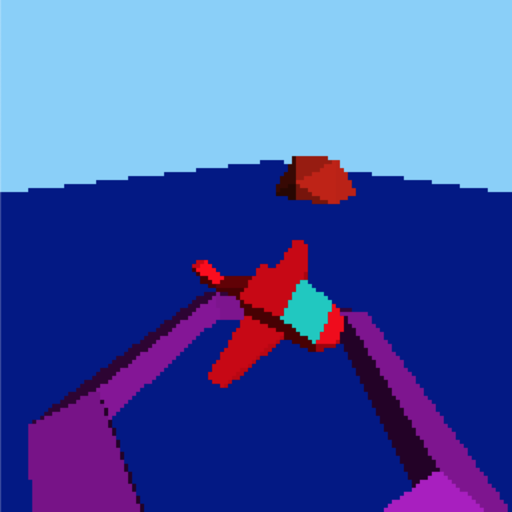

# Amber

## What's this

Amber is a tiny software 3d renderer written in TypeScript.




## Support

* Programmable shader
* Built-in flat shader
* Texture mapping
* Scene Graph
* Culling with AABB

## How to build

```sh
npm install blackspotbear/amber
```

## How to run demo

The demo is made with [Akashic Engine](https://github.com/akashic-games/akashic-engine/).

```sh
cd demo
npm install
npm run build
npm start # open http://localhost:3000/game/
```

## TODO

* [ ] Transparent object
* [ ] Render target
* [ ] Stencil buffer
* [ ] Matrix palette
* [ ] Particle
* [ ] Line primitive

and more.

## Known issues

* Tugboat lit incorrectly.

## License

This software is released under the MIT License, see LICENSE.txt.
